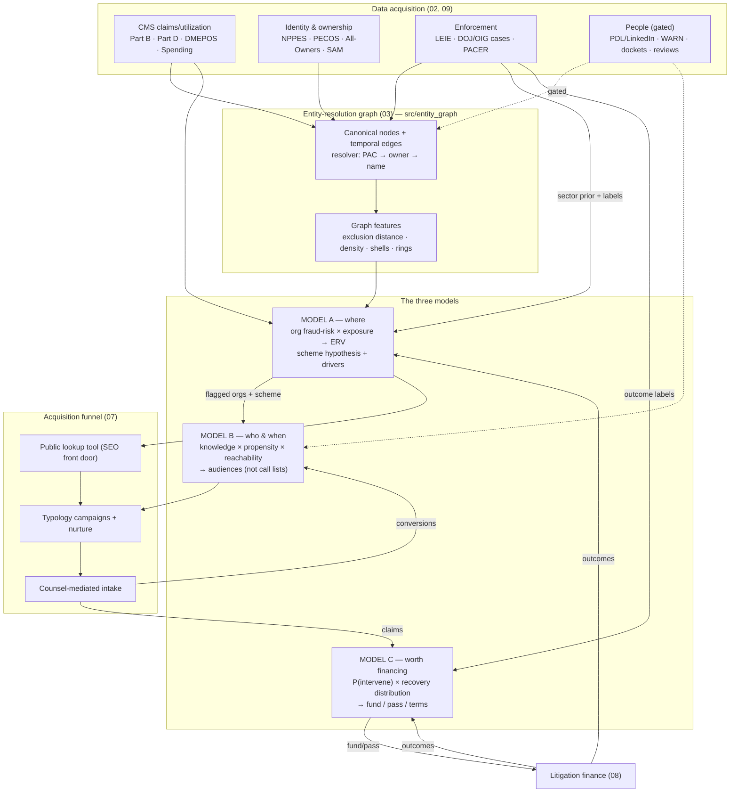

# 10 — Workflows and Model Rationale

How the system actually runs, end to end, and *why* it is designed this way. The
static architecture is in [ARCHITECTURE.md](ARCHITECTURE.md); this doc is the moving
parts.

## The system in one picture



## Why this design — the rationale, stated plainly

**1. Public data can find the defendant but cannot make the case.** Billing files
show *patterns*; the False Claims Act pays for *knowledge with intent and evidence*.
A case built mostly on public data invites the public-disclosure bar and weakens
original-source standing. So the product of Model A is not an accusation — it is a
*hypothesis about where insiders saw something*, and the business converts that
hypothesis into a human relationship. This single fact dictates the A→B→C chain.

**2. Each model answers a different question, on a different clock.**
- Model A answers **where** (which organizations), on a slow clock — public CMS files
  lag ~2 years, so A detects *structural, entrenched* schemes, which is exactly what
  durable FCA cases are made of.
- Model B answers **who and when** — the timing signal comes from *departures*
  (WARN, job changes, retaliation suits), which is near-real-time. The 6–18-month
  post-departure window is the sweet spot: memory fresh, acute fear past, statute open.
- Model C answers **is it worth money** — intervention is nearly binary for recovery
  (~$2.2B of $2.4B FY2024 qui tam recoveries were intervened/pursued), so P(intervene)
  is the underwriting target, with recovery as a distribution, not a point.

The system works because the clocks are combined: A's slow structural map × B's fast
human-timing signal.

**3. The entity graph is the only bridge between the two identity worlds.** Claims
data is NPI-centric; workforce data is employer-string-centric. They meet *only* at
the canonical Organization node. That is why entity resolution was built first
(Increment 1), why it carries confidence bands and provenance on every link, and why
employment/ownership edges are temporal — Model B's knowledge gate is a point-in-time
query ("was this person there *during the anomaly window*?").

**4. Everything starts heuristic and explainable, and earns its ML.** Labels are
scarce and slow (cases take years). So every model cold-starts as a transparent,
label-free composite that works day one — peer-relative robust z-scores with named
drivers (A), an additive weighted heuristic (B), DOJ-priority rules (C) — and
graduates to supervised learning only as outcomes accumulate. Explainability is not
a nice-to-have: it is defamation safety for the public tool, credibility for counsel,
and the audit trail for every lead.

**5. The compounding label set is the moat.** Resolved cases retrain A and C;
conversions retrain B; declinations and first-to-file losses are labels too. No
competitor can buy this off the shelf — it only accumulates by operating the funnel.

**6. One-sided, robust, peer-relative statistics — because the failure mode is
flagging the busiest legitimate provider.** Referral centers and subspecialists look
like outliers on raw volume. Hence: peer groups (specialty × geography × site), median/
MAD robust z (a few extreme billers can't distort the baseline), one-sided (only
excess is suspicious), volume-gated (low-claim ratios are unstable), de-correlated
concepts (one fact never double-counts), acuity controls, and a preference for
features hard to explain benignly (impossible-day, exclusion proximity, shells,
payment-utilization correlation) over raw size.

## Operational workflows

### W1 — Data refresh & graph rebuild (scheduled: monthly; annual for CMS PUFs)
```
new files land in ~/Desktop/data/preclean/<source>/        (09-data-procurement.md)
→ python -m src.attempt_2.ingest.integrate                  assertion-checked tables
→ python -m src.attempt_2.audit.*                           coverage + corruption gates
→ python -m src.attempt_2.ingest.features                   provider_features
→ python -m src.entity_graph --input .../processed          nodes/edges/features/rings
HALT on any assertion failure — a failed refresh never overwrites a good build.
```

### W2 — Organization scoring & dossier (after every refresh)
```
provider_features + org_graph_features
→ Layer 1 deterministic rules (billed-while-excluded, implausible rates)
→ Layer 2 concept anomaly (v3) at company grain
→ [next increment] scheme subscores → noisy-OR → × sector prior × graph boost
→ × exposure → ERV ranking
→ per-org DOSSIER: scheme hypothesis, named drivers, benign explanations,
  exposure estimate, confidence band, graph context (owners, rings, exclusions)
Output: ranked dossiers for human review — never auto-published accusations.
```

### W3 — Witness mapping (per flagged org; gated on people-data)
```
flagged org + scheme hypothesis
→ scheme-to-role matrix → target roles                       (src/model_b)
→ person_resolver: employer strings → canonical org          (graph, temporal)
→ TENURE GATE: employed during anomaly window? (hard filter)
→ B2 propensity (departure recency/type, grievance, tenure shape, …)
→ reachability → AUDIENCES: role × org × channel + message angle
Compliance check at exit: aggregated audiences only; person_priority never exported.
```

### W4 — Campaign → intake (continuous)
```
audiences → typology campaigns (education-first; no accusations)
public lookup tool → SEO inbound
→ landing pages → anonymous self-assessment → secure intake (no PHI)
→ triage score → COUNSEL REVIEW (privilege boundary — before deep facts)
→ corroboration plan (Model A dossier attached) → case packet
```

### W5 — Underwriting (per qualified case)
```
case packet → Model C features (scheme priority, defendant, evidence,
  corroboration, relator standing, jurisdiction, magnitude, timing)
→ FIRST-TO-FILE CHECK (PACER — hard gate)
→ P(intervene) + recovery P10/P50/P90 → expected relator gross
→ fund / pass / fund-with-terms (+ exploration tranche for reject-inference)
→ portfolio Monte Carlo before each new commitment
```

### W6 — Feedback & retraining (quarterly)
```
case outcomes (DOJ/PACER) → label store
→ retrain/recalibrate A (PU classifier) and C (intervention + recovery)
→ conversion data → retune B weights
→ refresh backtest (src/backtest pattern, generalized to enforcement labels)
→ update sector priors and DOJ-priority weights
```

## Control points (where a human is mandatory)

| Gate | Workflow | Why |
|---|---|---|
| Assertion failures | W1 | data integrity is non-negotiable |
| Low-confidence entity merges | W1/W2 | multi-state name merges route to review |
| Dossier review before any use | W2 | leads are hypotheses, not conclusions |
| Audience export | W3 | FCRA/solicitation/privacy guardrails |
| Counsel review at intake | W4 | privilege; safety screen; no PHI |
| First-to-file + funding decision | W5 | existential legal + capital risk |
